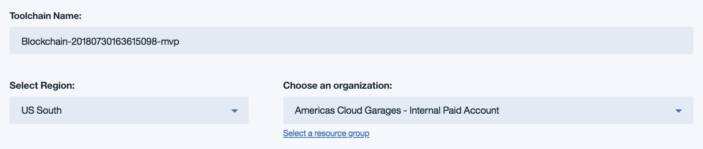
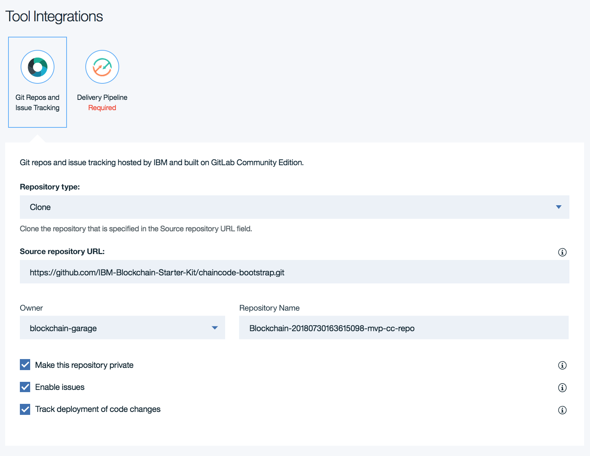
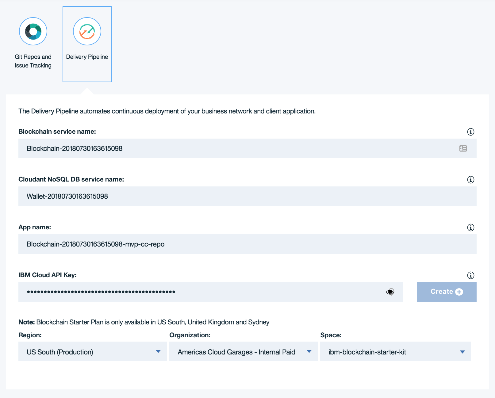

## Before you start

In order to follow this tutorial, you will need to know how to develop Hyperledge Fabric smart contracts.

Hyperledger Fabric is a platform for building blockchain applications. Hyperledger Fabric provides the blockchain technology itself, along with APIs and SDKs that allow you to develop smart contracts and end user applications.

You can learn more about Hyperledger Fabric, including how to set up your local development environment, by following the [Hyperledger Fabric tutorials](http://hyperledger-fabric.readthedocs.io/en/release-1.1/tutorials.html). 

In particular, we recommend that you follow the Hyperledger Fabric "Writing Your First Application" and "Chaincode for Developers" tutorials. These tutorials will teach you how to develop a smart contract, and build an end user application.

## Creating a new smart contract project and DevOps toolchain

To start building a new smart contract, you will first set up a DevOps toolchain that will automatically build, test, and deploy your smart contract to the IBM Blockchain Platform. The IBM Cloud DevOps service is used to run the DevOps toolchain, and a toolchain template that is suitable for developing smart contracts is provided.



Choose one of the following options to set up a DevOps toolchain for your new smart contract:

- [Create Go smart contract toolchain](https://console.ng.bluemix.net/devops/setup/deploy/?repository=https://github.com/IBM-Blockchain-Starter-Kit/blockchain-toolchain&branch=chaincode&platform=go&bootstrapRepo=https://github.com/IBM-Blockchain-Starter-Kit/chaincode-bootstrap.git)

- [Create Node.js smart contract toolchain](https://console.ng.bluemix.net/devops/setup/deploy/?repository=https://github.com/IBM-Blockchain-Starter-Kit/blockchain-toolchain&branch=chaincode&platform=js&bootstrapRepo=https://github.com/IBM-Blockchain-Starter-Kit/nodejs-chaincode-bootstrap.git)

The "Create a Toolchain" page will appear:

The first section of the form configures the name of the toolchain service, the region where the service will be hosted, and the cloud foundry organization which will administrate the service's settings. You should edit these fields as desired.

The second section of the form is a git repo and issue tracker configuration. Depending on which platform you selected, a scaffolding repository containing language-specific bootstrapping code is setup to be cloned into a gitlab repository with a corresponding issue tracker. You should edit these fields as desired.

The third section of the form is a delivery pipeline configuration. Here you can target existing service instances by specifying their identifiers or provide unregistered identifier(s) to create new instance(s). 

This delivery pipeline will queue a build stage when new changes are pushed to the chaincode repository. A successful build stage in turn will queue the unit test stage. These tests should be defined in the git repository, where examples will be provided. A successful test stage will queue the deploy stage. The deploy configuration should be defined in the git repository, where examples will be provided. The deploy stage will target the services specified in the delivery pipeline form. 

That's it! Click the "Create" button to create your new DevOps toolchain, and source repository. You should be taken to your newly created DevOps toolchain page.

The "Git" button in the middle will take you to your newly created smart contract repository. You will clone this repository into your local development environment, so you can work on your smart contract.

The "Delivery Pipeline" button on the right will take you to the delivery pipeline for your DevOps toolchain. From here, you can inspect the output from the latest automated build and deployment of your blockchain application.

## Cloning the new source repository

Click on the "CODE" tile to go to your newly created source repository. If you are no longer on the DevOps toolchain page,you can find a link to the toolchain in the repository description - useful if you have lost the link and need to find your way back!

Clone the repository to your local development environment using your preferred Git tool.

## Creating a Hyperledger Fabric smart contract

Your new Git repository will contain the project structure required to develop a smart contract in Go or Node.js, depending on which option you chose while creating the DevOps toolchain.

You can work on this smart contract using your favourite editor, following the documentation on the Hyperledger Fabric website.

After editing the smart contract, there will be pending changes in your Git repository. Add, commit, and push these changes into your Git repository. The DevOps toolchain you created earlier will detect these changes, and then automatically build, test, and deploy those changes to the IBM Blockchain Platform.

## Checking the status of the DevOps toolchain

Navigate to the DevOps toolchain page, and click on the "Delivery Pipeline" "DELIVER" tile. You should see the an overview of the current status of your delivery pipeline.

The delivery pipeline is made up of several phases, including "BUILD", "TEST", and "DEPLOY".

The "BUILD" phase of the delivery pipeline fetches the latest contents of your smart contract repository, and installs any dependencies.

The "TEST" phase runs all of the automated unit tests for your smart contract. If any unit tests fail, then the delivery pipeline will fail and your changes will not be deployed.

The "DEPLOY" phase of the delivery pipeline deploys your smart contracts into the IBM Blockchain Platform.

All build phases should be green and showing that no errors have occurred. If this is not the case, you must use the logs to investigate the cause of the errors. Click "View logs and history" on a build stage to find the latest logs.
